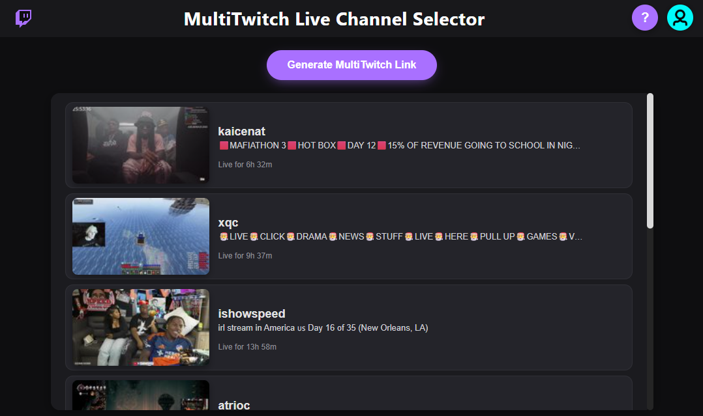

# MultiTwitch Live Selector

A web site allows Twitch users to select multiple live channels from their followed list and generate a MultiTwitch link to watch them simultaneously.

## Features

- **Twitch Authentication**: Log in with your Twitch account to access your followed channels.
- **Live Channel Selection**: View and select multiple live streams from your follows.
- **Stream Details**: See stream thumbnails, titles, and uptime for each live channel.
- **MultiTwitch Integration**: Generate links to watch selected streams on MultiTwitch.tv.
- **Direct Access**: Double-click any channel to open it directly in MultiTwitch.
- **Responsive Design**: Clean, dark-themed interface optimized for various screen sizes.

## How to Use

1. **Login**: This site uses the account logged in to Twitch.tv
2. **Select Channels**: Click on live channels to select them (green highlight indicates selection).
3. **Generate Link**: Click "Generate MultiTwitch Link" to open selected channels in a new tab.
4. **Direct Open**: Double-click any channel to open it immediately in MultiTwitch.
5. **Help**: Click the "?" button for usage instructions.

## Setup

This is a client-side web application hosted on GitHub Pages. No server setup required.

### Prerequisites

- A Twitch account
- A web browser

### Twitch API Setup

The app uses a Twitch Client ID for API access. The current setup is configured for the hosted version.

If you want to run this locally or modify it:

1. Register a Twitch application at [Twitch Developer Console](https://dev.twitch.tv/console/apps)
2. Replace the `clientId` in `index.html` with your own
3. Update the `redirectUri` to match your local/development URL

## Technologies Used

- HTML5
- CSS3
- JavaScript (ES6+)
- Twitch Helix API

## Contributing

Feel free to submit issues or pull requests for improvements.

## License

This project is open source. Please check the license file for details.

## Contact

For support or feedback: blake13blake@gmail.com
